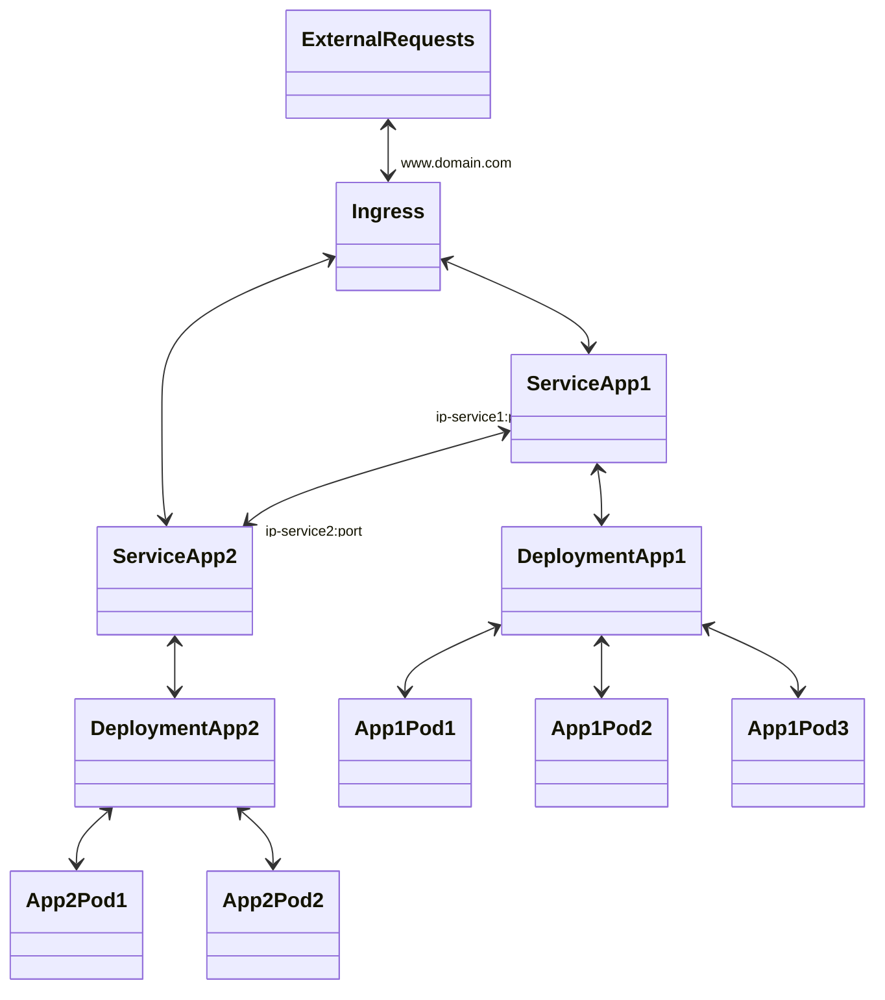

# **kubernetes-guide**

## **Installation**

Install a specific k8 version
https://stackoverflow.com/questions/49721708/how-to-install-specific-version-of-kubernetes/50447714

uninstall kubernetes
https://stackoverflow.com/questions/44698283/how-to-completely-uninstall-kubernetes

K8 necessary packages
kubeadm kubernetes administrator. initializes clusters etc.
kubelet  runs pods on different 
kubectl
minikube

## **Components**
---
A kubernetes cluster is composed of a master node or control plane and the worker nodes. The master node is the access to the cluster (and by extension to the k8 virtual network) and is tasked with controlling the rest of the cluster. <br>

NOTE: You can think of a K8 cluster as 2 distribution forms, one physical, one logical.<br>
The physical it's simple, a number of redundant master nodes, and a set of worker nodes.
The logical has a lot of components, Ingress to access the cluster, Pods of which there can be multiple replicas,  and services to link them. there can also be secrets, configurations etc.
A single pod with multiple replicas can be distributed between multiple nodes as k8 sees fit. <br>
multiple pods share a single service interface


## Control Plane (Master Node)
It runs a set of processes that manage the behavior of the cluster and the worker nodes. 

#### *Api Server* 
Entry point to the K8 cluster. all the kubernetes clients will talk to this process.
#### *Controller*
Manager. keeps track of whats happening in the cluster. If something needs to be repaired etc.
#### *Scheduler* 
Ensures pods placement. it knows the available resources of the cluster and the load that a pods needs, then assigns and schedules a pod.
#### *Etcd*
Holds all the configuration data and the status data of each node, and the back up and restore data to recover a node state.
### *Virtual Network. *
Its the component that connects the control plane and all the Worker nodes. Its what makes the cluster work as a single supercomputer.

## Worker Nodes
These components are the machines tasked with doing the work itself. the worker nodes, or simpky nodes, can run one or more pods which are applications themselves.
#### *Ingress*
Its an external entry point to the K8 cluster. like an ip address that can be accessed by anyone outside, and its useful to serve an application to the outside world basically.
An application can have many ingress rules, but to implement them you would need an ingress controller. this is an aditional system that runs on a pod that reads and applies the ingress rules accordingly for each request. there are many third party implementations.<br>
[Ingress Controllers](https://kubernetes.io/docs/concepts/services-networking/ingress-controllers/)<br>
[Ingress Controller Bare Metal](https://kubernetes.github.io/ingress-nginx/deploy/baremetal/)
#### *Deployment (Pods)*
A deployment is the configuration to run an application. The application (Container) is run within something called a Pod.
A pod is the smallest component in a K8 cluster. they are tasked with running a single container, and each pod gets its own ip address in the K8 virtual network. <br>
When deploying an application, we may want to make multiple instances of it, these are called replicas (Hence why you dont configure a single pod but a deployment which maybe or not be multiple pods). <br>
A deployment of an application allows us to define how many replicas (pods) of an application to distribute among the nodes. K8 checks the resources and knows where to place each replica.
Pods are ephimeral, so they can die if something goes wrong. however, even if a pod dies, its ip address and service will stay the same. 
#### *Service*
A service is the entry point to an application. its a static ip address inside the K8 virtual network and its port. because a single application can be distributed among multiple nodes as multiple pod replicas (Deployment), a service is shared among all of them and its what links them as a single app. since a service is a single entry point to an application, and the app has many copies (replicas), the service knows how to send a request to which replica to distribute the load correctly (its a load balancer).
#### *Config Map*
On a config map the administrator can set some constant values to reference in other configurations files for deployment
#### *Secret*
A secret is similar to a config map but it stores sensible information like passwords. to define variables they need to be stored as base64.
#### *StatefuSet*

#### *Exmample Diagram of a Deployment in a cluster*
There is a single ingress access to the applications.<br>
There are 2 applications, each deployed by their respective deployment config (Deployments represent the application)<br>
One application is deployed with 3 replicas, and the other with 2 replicas<br>
Lastly, applications communicate with each other via their service interface



## Commands

#### *Minikube - Test cluster*
Start minikube cluster
```sh
minikube start
```
Delete minikube cluster
```sh
 minikube delete -p minikube
 ```

#### *Kubeadm commands*

#### *Kubectl commands*

| Command      | Description |
| :---        |    ---:   |
|```kubectl get namespaces```| list namespaces       |
|```kubectl get deploy```| list deployments       |
|```kubectl describe deploy <pod>```|get deployment description|
|```kubectl delete deploy <deployment>```|remove deployment|
|```kubectl describe deploy <deployment>```|get deployment description|
|```kubectl get pods```| list pods       |
|```kubectl get pods -a```| list all pods        |
|```kubectl get pod -o wide```|get pod wideoutput|
|```kubectl get svc -o wide```|get service wideoutput|
|```kubectl get node -o wide```|get node wideoutput. Get internal Ip from this one|
|```kubectl run pod --image=<img_name>```|run a container on a pod|
|```kubectl apply -f <yaml_file>```|apply configuration|
|```kubectl delete pod <pod>```|remove deployment|
|```kubectl logs <pod>```|check container logs|
|```kubectl logs <pod> -f```|stream container logs|
|```kubectl get services```| list services       |
|```kubectl describe service <service>```|get deployment description|

For a complete [cheatsheet](https://kubernetes.io/docs/reference/kubectl/cheatsheet/) and advanced options like scale up, rollout etc.

## Deployment Configuration

#### *Namespace*
A namespace is a virtual segmentation of a cluster. to separate k8 resources and deployments etc from one another.
A simple way to create a namespace is to define a namespace.yaml file
```yaml
apiVersion: v1
kind: Namespace
metadata:
  name: <namespace-name>
```
#### *ConfigMap*
#### *Secret*
#### *Deployment*
#### *Service*
#### *Ingress*

## Other Resources and Tools
[Helm package manager](https://helm.sh/)<br>
[bash auto-completion](https://kubernetes.io/docs/tasks/tools/included/optional-kubectl-configs-bash-linux/)<br>
[Kubctx and Kubens for context and namespaces](https://github.com/ahmetb/kubectx)<br>
[prometeus for monitoring](https://prometheus.io/)<br>


